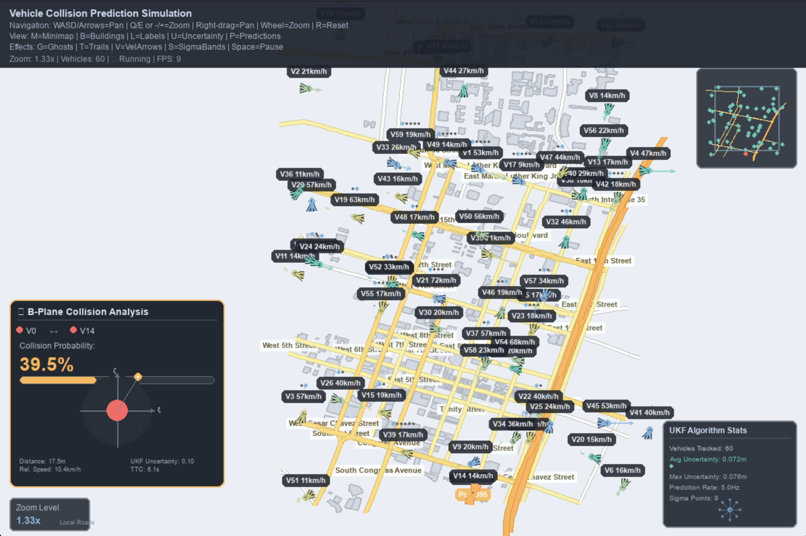

Vehicle Collision Prediction Simulation — Kalman + B-Plane

Overview
This project demonstrates the applicability of celestial mechanics equations to short-range vehicle collision prediction. The main objective is to show how b-plane miss-distance analysis, originally developed for asteroid close-approach probability calculations in astrodynamics, can be adapted for terrestrial vehicle collision prediction. The simulation combines an Unscented Kalman Filter (UKF) with a kinematic bicycle model and renders a road network with multiple vehicles in real-time, visualizing state uncertainty and collision risk using the same mathematical framework used for celestial object encounters.

Core Ideas: 
- Use a kinematic/dynamic bicycle model for vehicle motion.
- Estimate vehicle state and covariance online with UKF.
- Predict relative motion between two vehicles and project the relative position uncertainty onto a b-plane: a 2D plane orthogonal to the relative velocity vector (ξ, ζ axes).
- Compute collision probability by comparing the b-plane miss vector and combined covariance against a collision region.

Key Files
- game.py: Main simulation, rendering, input handling, and UI panels (map, vehicles, uncertainty ellipses, b-plane panel, UKF stats widget).
- utils/vehicle_algo.py: UKF-based vehicle model and collision simulation helper. Provides the process model update, UKF predict/update, and a basic is_collision method using a chi-square threshold in relative position space.
- data/: Road and building JSON files used by the renderer (e.g., data/austin.json, data/austin_buildings.json).
- config.json: Selects the current map to load (field current_map).
- setup_map.py and utils/fetch_*: Utilities to fetch/prepare map/building data if needed.
- docs/idea.md: Background and rationale for applying b-plane and UKF techniques.

How the Algorithm Works (utils/vehicle_algo.py)
1) State and Model
- State x = [x, y, v, ψ]ᵀ where x, y are planar position, v is speed, ψ is heading.
- Kinematic bicycle update for a timestep Δt with control input u = [a, δ] (acceleration and steering angle):
  x_{k+1} = x_k + v_k cos(ψ_k) Δt
  y_{k+1} = y_k + v_k sin(ψ_k) Δt
  ψ_{k+1} = ψ_k + (v_k / L) tan(δ_k) Δt
  v_{k+1} = v_k + a_k Δt
- Process/measurement noise are modeled with covariances Q and R, respectively.

2) UKF (Unscented Kalman Filter)
- Generates 2n+1 sigma points from the current state and covariance using the unscented transform (Cholesky-based square-root scaling).
- Propagates each sigma point through the bicycle model, then recombines using UKF weights to get predicted mean and covariance.
- Performs a measurement update using position + heading as the measurement vector.

3) Collision Determination (vehicle_simulation.is_collision)
- For each vehicle pair:
  - Compute the relative position and velocity.
  - Build the b-plane (orthonormal basis perpendicular to relative velocity) and project the combined position covariance into this plane to get a 2×2 covariance.
  - Compute a Mahalanobis distance of the projected miss vector and compare against a chi-square threshold for a chosen confidence level.
  - If within threshold, treat as a potential collision.

What You See on the Screen
Map Rendering
- Road network drawn with type-based styling and zoom-dependent filtering (major roads at low zoom; local roads appear as you zoom in).
- Optional buildings rendered as filled polygons at higher zoom.
- Vehicles rendered as arrowheads, with optional trails, velocity arrows, ghost projections, and uncertainty ellipses from the UKF covariance.

B-Plane Collision Analysis Panel (left-bottom)
- ξ/ζ axes: The b-plane axes; this plane is perpendicular to the relative velocity.
- Red danger circle: Collision radius region; if the miss point falls inside, risk is elevated.
- Miss point: The projected closest-approach point in b-plane coordinates.
- Uncertainty ellipses (1σ, 2σ, 3σ): Visualization of combined position covariance of the two vehicles projected into the b-plane. Larger ellipses indicate greater uncertainty.
- Probability readout and bar: Current collision probability estimate.
- Standby mode: When no pair is at risk, the panel remains visible but dimmed.

UKF Algorithm Status (bottom-right)
- Vehicles tracked: Count of active vehicles in the filter loop.
- Average/Max uncertainty: Derived from traces of each vehicle’s 2×2 position covariance.
- Prediction rate: How often the prediction check runs.
- Sigma points: A small animated conceptual visualization of the UKF sigma points around the mean.

Controls
- Navigation: Right-drag to pan; Mouse wheel to zoom; R resets view.
- Keyboard pan/zoom: WASD or Arrow keys to pan, Q/E or -/+ to zoom.
- Toggles:
  - M: Minimap
  - B: Buildings
  - L: Labels (roads/vehicles)
  - U: Uncertainty ellipses
  - P: Predictions (next-step marker/ellipse)
  - G: Ghost trajectories
  - T: Trails
  - V: Velocity arrows
  - S: Sigma bands mode
  - Space: Pause

Setup
1) Python environment
- Python 3.10+ recommended
- Install dependencies:
  pip install -r requirements.txt

2) Map data
- Set config.json with the desired map name:
  {
    "current_map": "austin"
  }
- Ensure data/<map>.json exists (e.g., data/austin.json). Optional: data/<map>_buildings.json for buildings.
- If you need to generate or fetch these files, use the provided utilities (e.g., setup_map.py or utils/fetch_* scripts) per your environment.

Run
python game.py

Performance Tips
- Zoom-based filtering reduces clutter at low zoom levels; zoom in to see more detail.
- Disable optional visuals (ghosts, trails, velocity arrows, sigma bands) for higher FPS.
- Buildings are only drawn at higher zoom levels to retain performance and readability.

Notes on Data and Coordinates
- The renderer converts lon/lat degrees to meters using a scale based on mean latitude to keep visuals consistent.
- Road styling is tuned for readability; line widths adapt with zoom.

By:
Kamaail Kaka, Mahesh Bacuh, Mohammad Rashid
